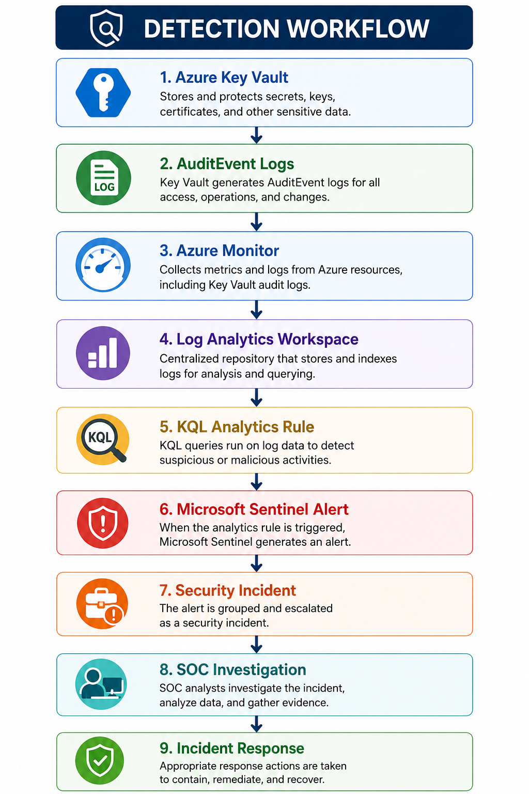
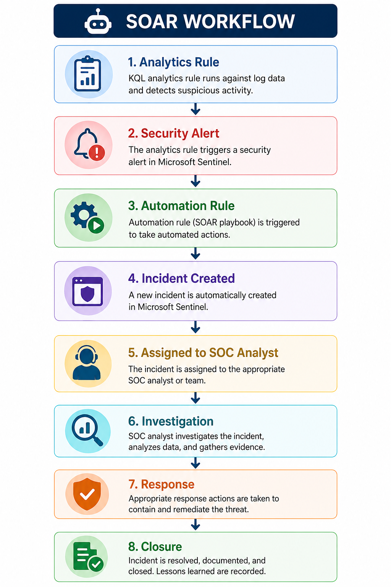
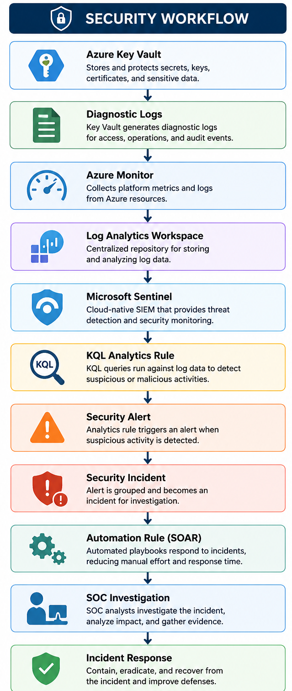

<p align="center">

# 🚀 Microsoft Sentinel SIEM & SOAR for Azure Key Vault Threat Detection

### Enterprise-Grade Cloud SIEM • SOAR Automation • Azure Security • KQL Threat Detection

</p>

---

<p align="center">


</p>

<p align="center">


</p>

<p align="center">


</p>

---

# 🖼️ Project Banner


---

# 📷 Architecture Diagram


---

# 📖 Project Overview

Modern Security Operations Centers (SOC) require centralized monitoring, intelligent threat detection, and automated incident response to reduce response times and improve operational efficiency.

This project demonstrates how **Microsoft Sentinel** integrates with **Azure Key Vault** to build an enterprise-grade, cloud-native SIEM and SOAR solution.

Azure Key Vault diagnostic logs are collected through **Azure Monitor** into an **Azure Log Analytics Workspace**, where custom **Kusto Query Language (KQL)** analytics detect suspicious Key Vault activities.

When abnormal behavior is detected, **Microsoft Sentinel** automatically generates security incidents and initiates response workflows through built-in automation capabilities.

The solution combines:

- Microsoft Sentinel
- Azure Monitor
- Azure Log Analytics Workspace
- Azure Key Vault Diagnostics
- Kusto Query Language (KQL)
- MITRE ATT&CK Framework
- Microsoft Sentinel Automation Rules

to provide continuous cloud security monitoring, threat detection, and automated incident response.

---

# 🎯 Project Objectives

- Deploy Azure Log Analytics Workspace
- Enable Microsoft Sentinel SIEM
- Configure Azure Key Vault Diagnostic Logging
- Centralize Azure Security Telemetry
- Develop Custom KQL Analytics Rules
- Detect Suspicious Azure Key Vault Activities
- Map Detections to MITRE ATT&CK
- Automate Incident Response
- Improve Cloud Threat Visibility

---

# 🏗️ Solution Architecture

This solution follows Microsoft's cloud-native security architecture for centralized log collection, threat detection, and automated incident response.


---

# ☁️ Azure Services Used

| Service | Purpose |
|----------|---------|
| Microsoft Sentinel | Cloud-native SIEM & SOAR |
| Azure Log Analytics Workspace | Centralized Log Storage |
| Azure Monitor | Telemetry Collection |
| Azure Key Vault | Secrets Management |
| Azure Resource Group | Resource Organization |
| Azure Diagnostics | Security Log Collection |
| Kusto Query Language (KQL) | Threat Detection |
| Microsoft Defender for Cloud *(Optional)* | Extended Cloud Security |

---

# 🛠️ Tech Stack

| Category | Technology |
|-----------|------------|
| Cloud Platform | Microsoft Azure |
| SIEM | Microsoft Sentinel |
| Monitoring | Azure Monitor |
| Log Storage | Azure Log Analytics Workspace |
| Secrets Management | Azure Key Vault |
| Query Language | Kusto Query Language (KQL) |
| Threat Detection | Microsoft Sentinel Analytics Rules |
| Automation | Microsoft Sentinel Automation Rules |
| Framework | MITRE ATT&CK |
| Security Operations | SOC |

---

# 🚀 Implementation Steps
## ① Create Azure Log Analytics Workspace

The Azure Log Analytics Workspace serves as the centralized repository for collecting, storing, and analyzing Azure security telemetry.

Microsoft Sentinel relies on this workspace to ingest diagnostic logs from Azure resources, enabling centralized threat detection and incident investigation.

### Screenshot


---

## ② Enable Microsoft Sentinel

Microsoft Sentinel was deployed on the Azure Log Analytics Workspace to transform it into a cloud-native SIEM platform.

Sentinel provides centralized security monitoring, advanced analytics, incident investigation, threat hunting, and automated response capabilities.

### Screenshot


---

## ③ Configure Azure Key Vault Diagnostic Settings

Azure Key Vault diagnostic settings were configured to forward **AuditEvent** logs into Azure Monitor and Log Analytics Workspace.

These logs provide visibility into authentication events, secret access operations, and administrative activities occurring within Azure Key Vault.

### Diagnostic Categories Enabled

- AuditEvent
- AzureDiagnostics
- Administrative Operations

### Screenshot


---

## ④ Create Custom Analytics Rule

A scheduled Microsoft Sentinel Analytics Rule was created using **Kusto Query Language (KQL)** to identify suspicious Azure Key Vault access behavior.

The analytics rule continuously analyzes incoming diagnostic logs and automatically generates incidents whenever predefined detection thresholds are exceeded.

### Rule Configuration

| Property | Value |
|----------|-------|
| Rule Type | Scheduled |
| Severity | High |
| Query Frequency | Every 5 Minutes |
| Lookup Period | Last 5 Minutes |
| Incident Creation | Enabled |
| Alert Grouping | Enabled |
| MITRE ATT&CK | Enabled |

### Screenshot


---

# 🔍 KQL Detection Query

```kusto
AzureDiagnostics
| where ResourceProvider == "MICROSOFT.KEYVAULT"
| where Category == "AuditEvent"
| summarize AccessCount = count() by Resource, CallerIPAddress, bin(TimeGenerated, 5m)
| where AccessCount > 3
```

---

## 📝 Detection Logic

This analytics rule continuously monitors Azure Key Vault **AuditEvent** logs stored within the **AzureDiagnostics** table.

The query groups events by Azure Key Vault resource and caller IP address over a rolling five-minute window.

If a single IP address performs more than **three operations within five minutes**, Microsoft Sentinel identifies the activity as potentially suspicious and generates a security incident for further investigation.

This detection technique helps identify abnormal Key Vault access patterns that may indicate compromised credentials, automated enumeration, excessive secret retrieval, or unauthorized cloud activity.

### Detection Focus

- Suspicious Authentication Activity
- Excessive Secret Retrieval
- High-Frequency Key Vault Requests
- Unauthorized Access Attempts
- Potential Credential Misuse
- Abnormal Cloud Activity

---

## 📊 Detection Workflow




---

## ⑤ Configure Automated Response (SOAR)

Microsoft Sentinel Automation Rules were configured to automatically execute predefined response actions whenever a security incident is generated.

Automating repetitive SOC tasks reduces analyst workload and significantly improves incident response times.

### Automated Actions

- Create Security Incident
- Update Incident Status
- Assign Incident Owner
- Set Incident Severity
- Trigger SOC Investigation Workflow

### Screenshot


---

## 🤖 SOAR Workflow




---

## ⑥ Trigger Security Incident

After diagnostic logs were successfully ingested and the analytics rule executed, Microsoft Sentinel automatically generated a security incident for investigation.

The incident included relevant event details, affected Azure resources, source IP addresses, timestamps, and associated MITRE ATT&CK mappings.

### Screenshot


---

# ⚔️ MITRE ATT&CK Mapping

| Tactic | Technique | Technique ID |
|---------|-----------|--------------|
| Discovery | Cloud Service Discovery | T1526 |
| Collection | Data from Information Repositories | T1213 |
| Defense Evasion | Valid Accounts | T1078 |

> **Note:** MITRE ATT&CK mappings should always align with the implemented detection logic and organizational threat model.

---

# 🔐 Security Controls Implemented

- Microsoft Sentinel SIEM
- Azure Monitor
- Azure Key Vault Diagnostic Logging
- Azure Log Analytics Workspace
- Custom KQL Threat Detection
- Scheduled Analytics Rules
- Automated Incident Creation
- SOAR Automation Rules
- Incident Assignment Workflow
- Alert Correlation
- Security Monitoring
- Cloud Threat Detection
- MITRE ATT&CK Classification
- Incident Prioritization

  ---

# ⭐ Repository Features

- ✅ Cloud-Native SIEM Architecture
- ✅ Azure Key Vault Security Monitoring
- ✅ Azure Monitor Integration
- ✅ Azure Log Analytics Workspace
- ✅ Microsoft Sentinel Analytics Rules
- ✅ Custom KQL Threat Detection
- ✅ Automated Incident Creation
- ✅ Microsoft Sentinel SOAR Automation
- ✅ MITRE ATT&CK Mapping
- ✅ Security Incident Investigation Workflow
- ✅ Cloud Threat Detection
- ✅ Security Operations Center (SOC) Monitoring

---

# 📊 Skills Demonstrated

| Domain | Skills |
|----------|---------|
| Cloud Security | Microsoft Azure Security |
| SIEM | Microsoft Sentinel |
| SOAR | Microsoft Sentinel Automation Rules |
| Monitoring | Azure Monitor |
| Logging | Azure Log Analytics Workspace |
| Identity Security | Azure Key Vault |
| Threat Detection | Kusto Query Language (KQL) |
| Detection Engineering | Analytics Rule Development |
| Incident Response | SOC Investigation |
| Threat Framework | MITRE ATT&CK |

---

# 🎓 Key Learning Outcomes

This project provided hands-on experience in designing and implementing an enterprise-grade Microsoft Sentinel SIEM solution integrated with Azure Key Vault.

Key learning outcomes include:

- Building cloud-native SIEM architectures
- Centralizing Azure security telemetry
- Configuring Azure Key Vault diagnostic logging
- Developing custom KQL detection rules
- Implementing Microsoft Sentinel Analytics Rules
- Automating incident response using SOAR
- Investigating cloud security incidents
- Mapping detections to the MITRE ATT&CK Framework
- Applying SOC investigation workflows
- Improving Azure cloud security visibility

---

# 🚀 Future Enhancements

Future improvements planned for this project include:

- Microsoft Sentinel Playbooks (Azure Logic Apps)
- Email Notification Automation
- Microsoft Teams Integration
- Microsoft Defender XDR Integration
- Microsoft Defender for Cloud Integration
- Threat Intelligence Indicators
- Watchlists
- User & Entity Behavior Analytics (UEBA)
- Fusion Detection
- Microsoft Security Copilot Integration
- Automated Ticket Creation
- Geo-IP Enrichment
- Incident Escalation Workflow
- Threat Hunting Queries Dashboard
- Azure Workbook Dashboards

---

# 📈 Security Workflow



---

# 📚 References

- Microsoft Sentinel
- Azure Monitor
- Azure Key Vault
- Azure Log Analytics Workspace
- Microsoft Learn
- MITRE ATT&CK Framework
- Kusto Query Language (KQL)

---

# 🧹 Cleanup

Delete all Azure resources after completing the lab.

```bash
az group delete --name rg-sc500-sentinel-lab --yes --no-wait
```

---

# 👨💻 Author

## Amal Udayanga Basnayake

**Cloud Security Engineer | Cybersecurity Professional**

Specializing in:

- Microsoft Sentinel
- Microsoft Security
- Azure Security
- Cloud Security
- SIEM
- SOAR
- Kusto Query Language (KQL)
- Threat Detection Engineering
- Incident Response
- Security Operations Center (SOC)

---

# 🤝 Connect With Me

- 💼 LinkedIn: https://www.linkedin.com/in/amal-udayanga-basnayake
- 💻 GitHub: https://github.com/AmalUBasnayake
- 🌐 Portfolio: https://amalcyberlab.vercel.app/

---

# ⭐ Support

If you found this project useful:

- ⭐ Star this repository
- 🍴 Fork the project
- 📢 Share it with others
- 💼 Connect with me on LinkedIn

Your support is greatly appreciated!

---

<p align="center">

## 🚀 Enterprise Cloud Security • Microsoft Sentinel • Azure Security • SIEM • SOAR • KQL • Threat Detection

**Built with Microsoft Azure & Microsoft Sentinel**

⭐ If you found this project helpful, please consider giving it a star!

</p>
