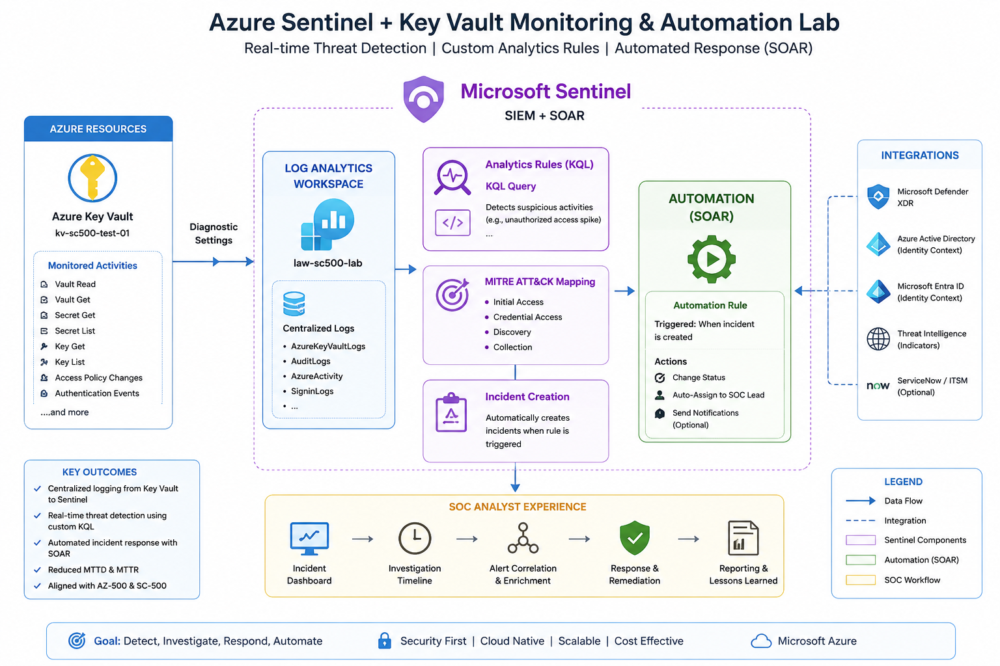
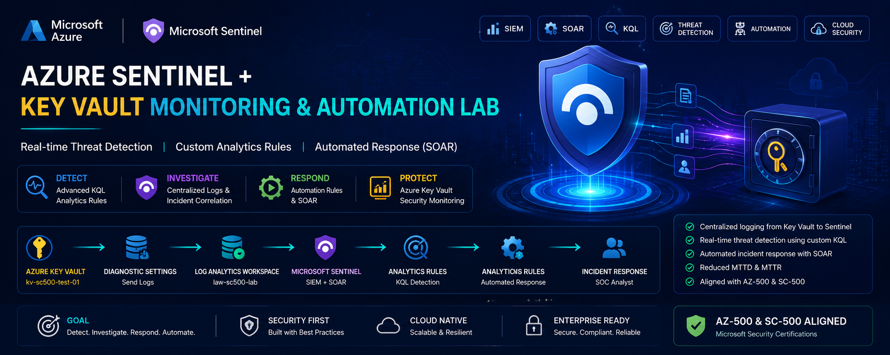
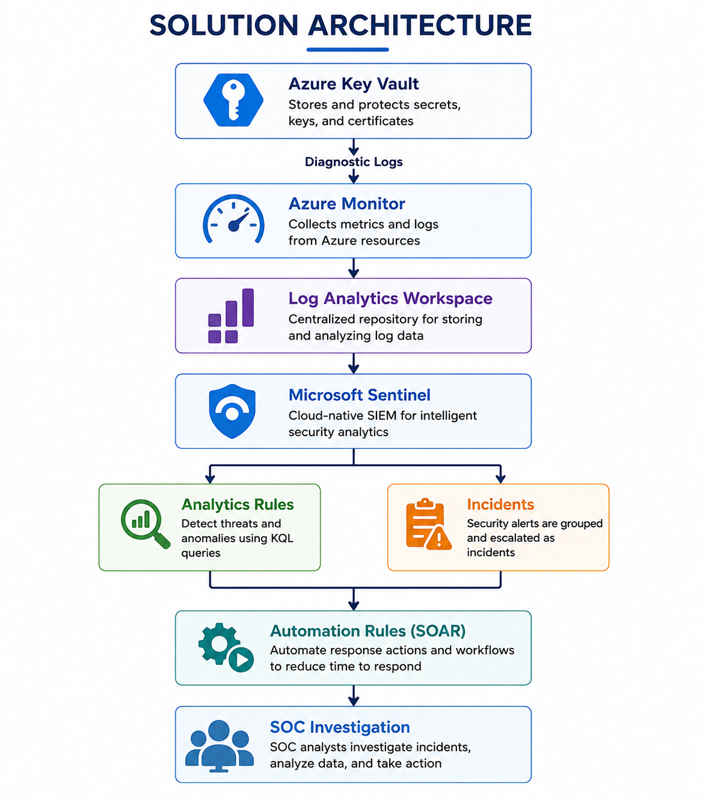
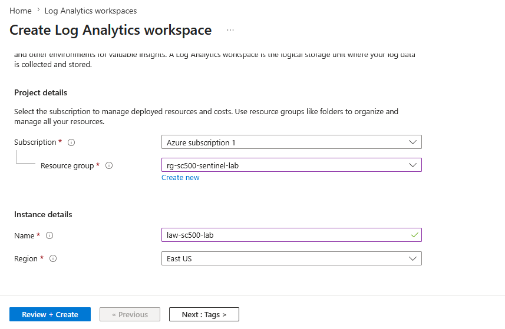
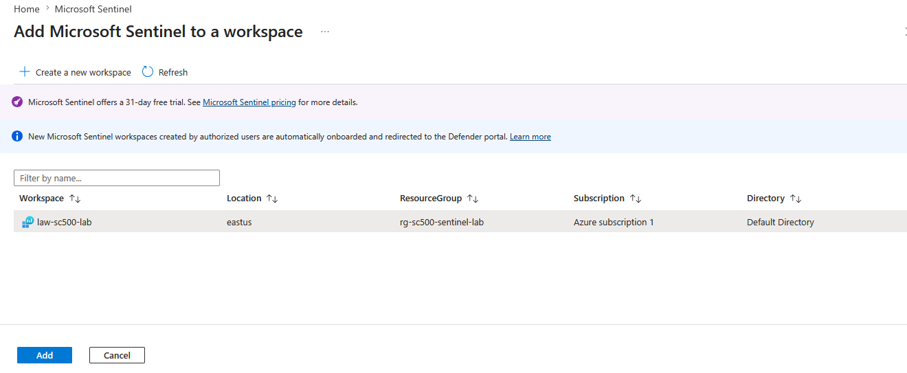
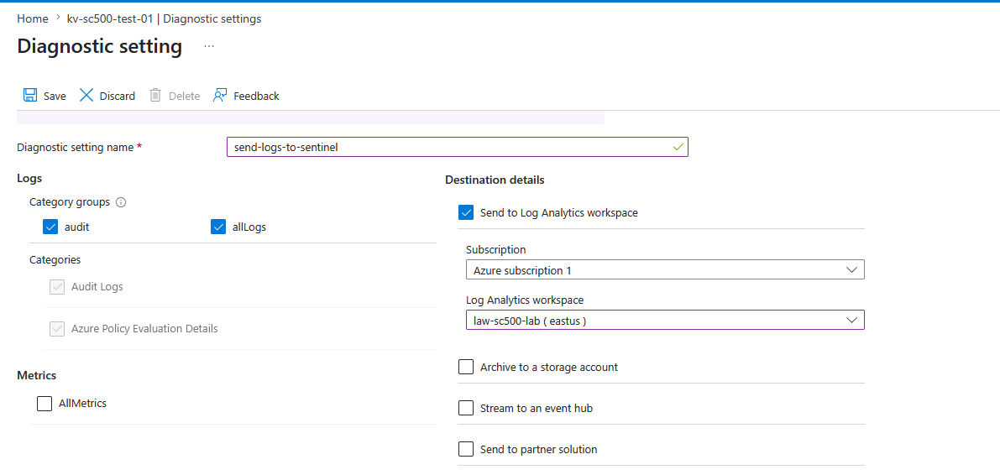
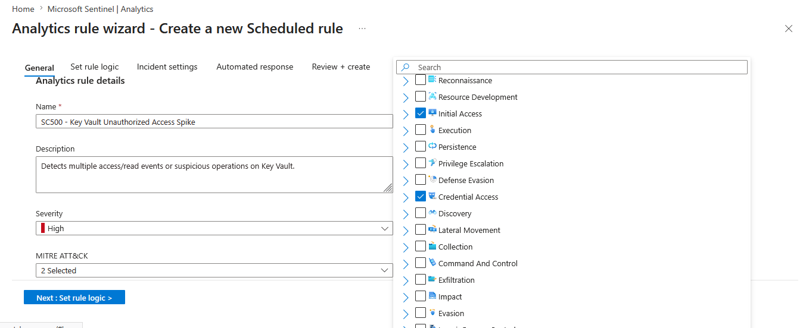
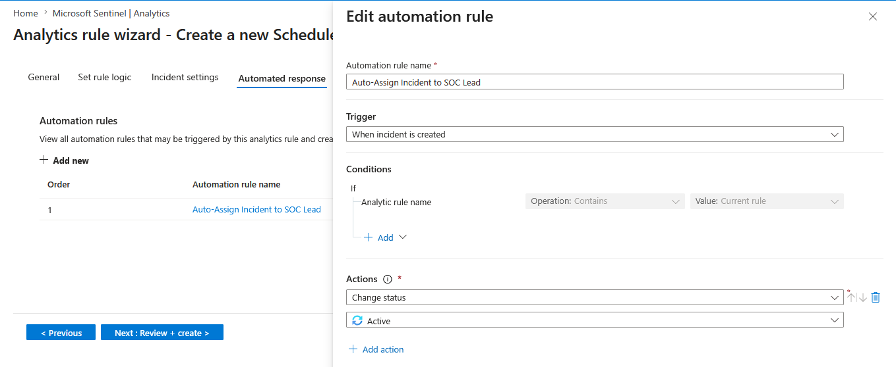
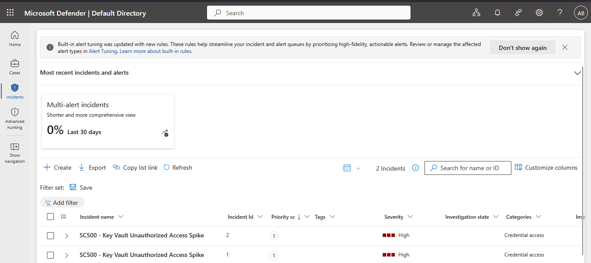

<p align="center">


</p>

<h1 align="center">
🔍 Microsoft Sentinel Key Vault Threat Detection & SOAR Automation Lab
</h1>

<p align="center">
Enterprise SIEM • SOAR • KQL Analytics • Microsoft Sentinel • Azure Key Vault
</p>

---

# 📷 Architecture Duagram




---

# 🖼️ Project Banner





---

# 📖 Project Overview

Modern Security Operations Centers (SOC) require centralized monitoring, intelligent threat detection, and automated incident response to minimize response time and reduce operational overhead.

This project demonstrates how Microsoft Sentinel can be integrated with Azure Key Vault to build an enterprise-grade cloud-native SIEM and SOAR solution capable of detecting suspicious Key Vault activities using custom Kusto Query Language (KQL) analytics and automatically initiating response workflows.

The solution combines Azure Monitor, Log Analytics Workspace, Microsoft Sentinel, Azure Key Vault diagnostics, MITRE ATT&CK mapping, and Sentinel Automation Rules to provide continuous security monitoring and incident orchestration.

---

# 🎯 Project Objectives

- Deploy Azure Log Analytics Workspace
- Enable Microsoft Sentinel SIEM
- Configure Azure Key Vault diagnostic logging
- Centralize security telemetry
- Develop custom KQL analytics rules
- Map detections to MITRE ATT&CK tactics
- Automate incident response using SOAR
- Improve cloud security monitoring capabilities

---

# 🏗️ Solution Architecture



---

# ☁️ Azure Services Used

- Microsoft Sentinel
- Azure Log Analytics Workspace
- Azure Key Vault
- Azure Monitor
- Azure Resource Group
- Microsoft Defender Integration
- Kusto Query Language (KQL)

---

# 🚀 Implementation Steps

---

## ① Create Log Analytics Workspace

The Log Analytics Workspace acts as the centralized data repository where Azure security logs are collected before being analyzed by Microsoft Sentinel.

### Screenshot



---

## ② Enable Microsoft Sentinel

Microsoft Sentinel was enabled on the Log Analytics Workspace to transform it into a cloud-native SIEM platform capable of collecting, correlating, and investigating security events.

### Screenshot



---

## ③ Configure Azure Key Vault Diagnostic Settings

Azure Key Vault diagnostic logs were configured to stream security events into Log Analytics, enabling continuous monitoring of Key Vault activities.

### Screenshot



---

## ④ Create Custom Analytics Rule

A scheduled analytics rule was created using Kusto Query Language (KQL) to detect abnormal Key Vault access patterns such as unauthorized access spikes.

The rule includes:

- High Severity
- MITRE ATT&CK Mapping
- Scheduled Query
- Incident Creation

### Screenshot



---

## ⑤ Configure Automated Response (SOAR)

Microsoft Sentinel Automation Rules were configured to automatically perform predefined actions whenever a security incident is generated.

Automated actions include:

- Incident Status Update
- Automatic Assignment
- SOC Workflow Triggering

### Screenshot



---

## ⑥ Trigger Security Incident

After telemetry collection and rule execution, Microsoft Sentinel generated a security incident for investigation.

### Screenshot





---

# 🔍 Detection Logic

The custom KQL rule monitors Azure Key Vault logs to identify suspicious authentication patterns and abnormal access behavior.

Detection focuses on:

- Unauthorized access attempts
- Access frequency spikes
- Repeated failures
- Suspicious read operations

---

# ⚔️ MITRE ATT&CK Mapping

| Tactic | Technique |
|----------|-----------|
| Initial Access | Credential Abuse |
| Credential Access | Credential Theft |
| Discovery | Cloud Resource Discovery |
| Collection | Sensitive Data Access |

---

# 🔐 Security Controls Implemented

- Centralized Security Monitoring
- Azure Key Vault Diagnostics
- Microsoft Sentinel SIEM
- KQL Threat Detection
- Automated Incident Creation
- SOAR Automation
- MITRE ATT&CK Classification
- Incident Assignment Workflow

---

# 📊 Skills Demonstrated

- Microsoft Sentinel
- Azure Security
- Cloud SIEM
- SOAR Automation
- Microsoft Defender
- Azure Key Vault
- KQL Query Development
- Log Analytics
- Threat Detection Engineering
- Security Operations (SOC)
- Incident Response
- MITRE ATT&CK Framework

---

# 🎓 Key Learning Outcomes

This project provided practical experience in:

- Building cloud-native SIEM solutions
- Designing custom threat detection logic
- Collecting Azure diagnostic logs
- Implementing automated incident response
- Mapping detections to MITRE ATT&CK
- Investigating cloud security events

---

# 🚀 Future Enhancements

- Logic Apps Playbooks
- Email Notification Automation
- Microsoft Teams Integration
- Threat Intelligence Indicators
- UEBA Analytics
- Watchlists
- Fusion Detection
- Microsoft Defender XDR Integration

---

# 🧹 Cleanup

```bash
az group delete --name rg-sc500-sentinel-lab --yes --no-wait
```

---

# 👨‍💻 Author

**Amal Udayanga Basnayake**

Cybersecurity Undergraduate | Cloud Security Engineer

Microsoft Security • Microsoft Sentinel • Azure Security • SIEM • SOAR • KQL • Cloud Security • DevSecOps

---

# ⭐ If you found this project useful

Please consider giving this repository a ⭐ and connecting with me on LinkedIn.
